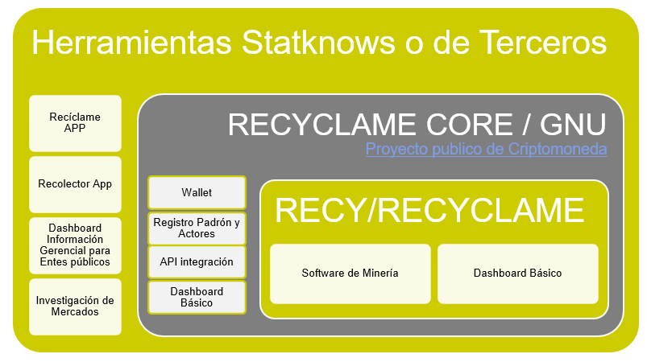

Hemos pasado de tener un prototipo y estamos abriéndonos para que la comunidad colabore con nosotros y estamos haciendo las adecuaciones necesarias. 

Si deseas colaborar con nosotros unete a nuestro discord https://discord.gg/nG3CB85PH4.

Para los que desean colaborar con nosotros, regístrense en el discord, por allí nos podemos coordinar

# RECYCLAME

</img>

RECYCLAME es la composicion de muchos componentes entre componentes privados y publicos desarrollados para llevar la trazabilidad de material reciclable. 

El core de RECYCLAME es llevar la trazabilidad de los materiales reciclables, por ahora nos enfocamos al Plasticos
Esta es una plataforma global que estara a disposicion de cualquier persona o empresa en el mundo que esté dispuesta a integrar con nuestra plataforma

Este es el eslabón perdido de datos de la economía circular, actualmente existen muchas iniciativas de reciclaje, sistemas de puntos e incentivos a los usuarios por reciclar. y muy pocos nos ayudan a conocer la cantidad de material reciclable que está circulando.  La mayoría de estos sistemas comienza a trabajar cuando el usuario entrega el material reciclable, en cambio nosotros trabajamos desde que un producto sale de la planta y termina cuando se entrega al reciclador.

RECYCLAME nos permitirá registrar los movimientos de plásticos en tiempo real y con esto poder proyecta la cantidad de material circulantes en cada ciudad o región, imaginense que vamos a tener una encuesta diaria de los materiales circulantes e información histórica sobre las tendencias, con nuestra experiencia haciendo modelos estadísticos podemos proyectos los valores recopilados a todo el País con un nivel de error pequeño.

Módulos Adicionales que pueden ser de alcance regional o global:

- Contenedor inteligente: Es el desarrollo de un contenedor desarrollado en Chile,  que esté conectado con el sistema de trazabilidad para informar los material reciclables que salen de circulación.

- App RECYCLAME: aplicación en manos del cliente,
Es la cara visible del sistema que recompensa a los usuarios por confiar los datos de sus compras a nuestro sistema para llevar la trazabilidad de los materiales reciclable, Premia a los usuarios por llevar los envases y contenedores plásticos y ser reciclados Sistema de recolección de material reciclable a domicilio

- Se puede crear un sistema de integración con otros contenedores existente en la ciudad y establecer alianza
Aprovecho para proponer que nos reunamos una vez a la semana para conversar,  analizar y proponer sobre este proyecto, y así mantenernos actualizados.

Repositorios

[Continua con RECYCLAME CORE](CORE/Solidity.md)

[Continua con RECYCLAME APP](support/ReciclameApp.pdf)

Documentos Anexos
[Continua con RECYCLAME APP](support/AntecedentesdelplasticoenChile_JAal18mayo2021.pdf)

Deprecate

[Continua con RECYCLAME CORE](RECYCLAMECORE/README.md)
