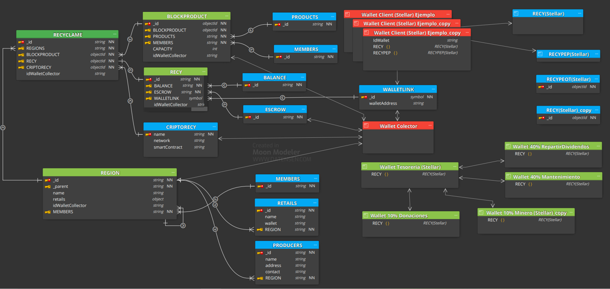

# RECICLAME CORE

</img>

Componentes:

- **[Productos](RECYCLAMECORE/PRODUCTOS.md)**
- **[Wallets](RECYCLAMECORE/WALLETS.md)**
- **[Tokens](RECYCLAMECORE/TOKENS.md)**
- **[API](https://app.swaggerhub.com/apis-docs/jlopez1967/Recyclame/1.0.0-oaa2)** para inteactuar con la plataforma [Espeficicaciones](RECYCLAMECORE/API.md), 
- **[Administrador de la plataforma](http://recy.statknows.com:3000/)** [Espeficicaciones](RECYCLAMECORE/ADMINISTRADOR.md)
- **[Dashboard](RECYCLAMECORE/DASHBOARD.md)** visualizacion de los movimientos del material reciclable

Actores

- **[Productores](RECYCLAMECORE/PRODUCTORES.md)**
- **[Regiones](RECYCLAMECORE/REGIONES.md)**
- **[Retails](RECYCLAMECORE/RETAILS.md)**
  
[Arquitectura de la Solucion](RECYCLAMECORE/ARQUITECTURA.md) 

Repositorios

- [RECYCLAME CORE](http://google.com)
- [API Source](https://gitlab.com/recy/apirecyclame.git)
- [Administrador de la plataforma](https://gitlab.com/recy/administrador.git)

Desarrollo

[Desarrollo de API](RECYCLAMECORE/DESARROLLADORES.md) 
